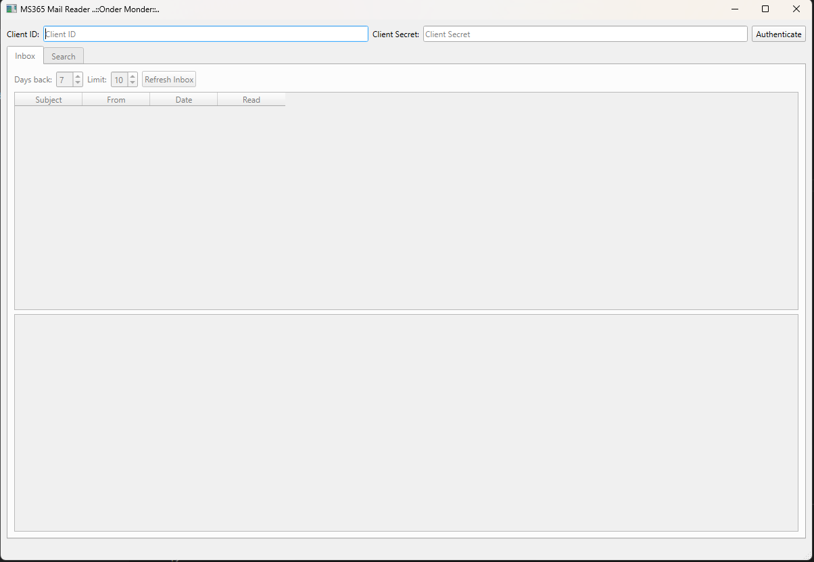

# O365Integration-python

O365 Integration in Python can be achieved using the O365 Python library, which allows you to interact with Microsoft Office 365 services such as Outlook, Calendar, OneDrive, and more. Here's a basic guide to help you get started with integrating Office 365 in Python using this library.

Step-by-Step Guide:
1. Install the O365 Library
To install the O365 Python package, you can use pip:
pip install O365

2. Authentication
You need to authenticate with the Microsoft Graph API. This requires an Azure Active Directory (Azure AD) app, which can be created in the Azure Portal.

Navigate to Azure Active Directory > App Registrations.
Click New Registration and follow the prompts to create your app.
After creating the app, note the Client ID and Tenant ID.
Under API Permissions, grant the necessary permissions for the services you want to use (e.g., Mail, Calendar, etc.).
Create a Client Secret under the Certificates & secrets section.

4. Common Use Cases
Send Emails: You can send emails, set attachments, and add recipients as shown in the example above.

Manage Calendar Events: You can access and manage calendar events:

3. Connect to O365 with Python
Here's an example of how to authenticate and connect to the Office 365 services, such as sending emails:

5. Permissions and Scopes
When authenticating, you must define the required permissions (scopes) based on the service you're accessing:

For Mail access: message_all
For Calendar access: calendar_all
For OneDrive access: onedrive_all

6. Token Storage
After the initial authentication, the token will be stored for reuse in future sessions. Make sure to manage token storage securely in production environments.

Python'da O365 Entegrasyonu, Outlook, Takvim, OneDrive ve daha fazlası gibi Microsoft Office 365 hizmetleriyle etkileşim kurmanıza olanak tanıyan O365 Python kitaplığı kullanılarak gerçekleştirilebilir. Bu kitaplığı kullanarak Office 365'i Python'da entegre etmeye başlamanıza yardımcı olacak temel bir kılavuzu burada bulabilirsiniz.

Adım Adım Kılavuz:
1. O365 Kitaplığını Kurun
O365 Python paketini kurmak için pip kullanabilirsiniz:
pip kurulumu O365

2. Kimlik Doğrulama
Microsoft Graph API ile kimlik doğrulaması yapmanız gerekir. Bunun için Azure Portal'da oluşturulabilecek bir Azure Active Directory (Azure AD) uygulaması gerekir.

Azure Active Directory > Uygulama Kayıtları'na gidin.
Yeni Kayıt'a tıklayın ve uygulamanızı oluşturmak için talimatları izleyin.
Uygulamayı oluşturduktan sonra Müşteri Kimliğini ve Kiracı Kimliğini not edin.
API İzinleri altında, kullanmak istediğiniz hizmetler (ör. Posta, Takvim vb.) için gerekli izinleri verin.
Sertifikalar ve sırlar bölümünün altında bir İstemci Sırrı oluşturun.

4. Yaygın Kullanım Durumları
E-posta Gönder: Yukarıdaki örnekte gösterildiği gibi e-posta gönderebilir, ekler ayarlayabilir ve alıcı ekleyebilirsiniz.

Takvim Etkinliklerini Yönetin: Takvim etkinliklerine erişebilir ve onları yönetebilirsiniz:

3. Python ile O365'e bağlanın
Aşağıda, e-posta gönderme gibi Office 365 hizmetlerine nasıl kimlik doğrulaması yapılacağına ve bu hizmetlere nasıl bağlanılacağına ilişkin bir örnek verilmiştir:

5. İzinler ve Kapsamlar
Kimlik doğrulama sırasında, eriştiğiniz hizmete göre gerekli izinleri (kapsamları) tanımlamanız gerekir:

Posta erişimi için: message_all
Takvim erişimi için: takvim_all
OneDrive erişimi için: onedrive_all

6. Token Depolama
İlk kimlik doğrulamanın ardından jeton, gelecek oturumlarda yeniden kullanılmak üzere saklanacaktır. Üretim ortamlarında belirteç depolamayı güvenli bir şekilde yönettiğinizden emin olun.
sağlıcakla ..:: Önder Mönder ::..
